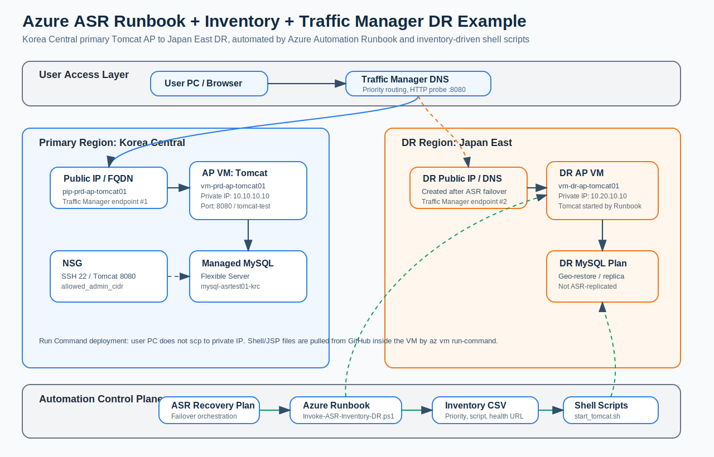

# Azure Runbook + Inventory + ASR + Traffic Manager DR Test

This repository provides a lab example for disaster recovery automation on Azure.

The scenario is a **single AP server running Tomcat in Korea Central**, connected to **Azure Database for MySQL Flexible Server**, with DR failover to **Japan East** using **Azure Site Recovery (ASR)**. Because Application Gateway may be blocked by a lab policy such as `Deny Expensive Network Resources`, this version uses **Azure Traffic Manager** as the global DNS-based entry point.



## 1. Architecture Overview

```text
User PC / Browser
  |
  v
Traffic Manager DNS
  |
  +-- Priority 1: Korea Central Tomcat Public IP
  |
  +-- Priority 2: Japan East Tomcat Public IP or DNS after ASR failover

Tomcat AP VM
  |
  v
Azure Database for MySQL Flexible Server
```

Traffic Manager is **not** a Layer 7 reverse proxy. It does not provide HTTP path routing or backend pool routing like Application Gateway. It provides **DNS-based global routing**, which is useful for DR failover from the primary endpoint to the DR endpoint.

## 2. DR Failover Flow

```text
Korea Central outage
  |
  v
ASR Recovery Plan starts
  |
  +-- Fail over AP VM to Japan East
  |
  +-- Execute Azure Automation Runbook
  |     +-- Read inventory/dr-inventory.csv
  |     +-- Confirm VM state
  |     +-- Execute scripts/linux/start_tomcat.sh
  |     +-- Run Tomcat health check
  |
  +-- Enable the Traffic Manager DR endpoint
  |
  +-- User validates the Tomcat test page
```

## 3. Region Design

| Component | Primary | DR |
|---|---|---|
| Region | Korea Central | Japan East |
| AP | VM + Tomcat + Public IP | ASR failover VM + Public IP or DNS |
| Database | Azure Database for MySQL Flexible Server | Geo-restore, read replica, or separate DR MySQL plan |
| Global routing | Traffic Manager Priority 1 | Traffic Manager Priority 2 |
| Automation | Azure Automation Runbook | Same or DR Automation Account |
| Inventory | Git, Storage, or CSV | Same CSV with `Environment=DR` |

## 4. Repository Structure

```text
.
├── inventory/
│   └── dr-inventory.csv
├── runbooks/
│   └── Invoke-ASR-Inventory-DR.ps1
├── scripts/
│   ├── asr/
│   │   └── create_asr_lab_example.sh
│   └── linux/
│       ├── start_tomcat.sh
│       └── check_tomcat.sh
├── app/
│   └── tomcat-test/index.jsp
├── sql/
│   └── init.sql
├── docs/
│   ├── commands-traffic-manager-runcommand.md
│   └── images/
│       └── asr-runbook-traffic-manager-architecture.svg
└── terraform/
    ├── main.tf
    ├── variables.tf
    └── terraform.tfvars.example
```

## 5. Why Run Command Is Used Instead of SCP

If the VM has only a private IP address, a user PC cannot directly run:

```bash
scp scripts/linux/start_tomcat.sh azureuser@10.10.10.10:/tmp/
```

This lab uses `az vm run-command` instead. The VM downloads the shell scripts from GitHub from inside Azure:

```bash
az vm run-command invoke \
  -g rg-prd-app-krc \
  -n vm-prd-ap-tomcat01 \
  --command-id RunShellScript \
  --scripts "
sudo mkdir -p /opt/runbook
sudo curl -L -o /opt/runbook/start_tomcat.sh https://raw.githubusercontent.com/sonmap/Azure_Runbook_Inventory_ASR_test01/main/scripts/linux/start_tomcat.sh
sudo curl -L -o /opt/runbook/check_tomcat.sh https://raw.githubusercontent.com/sonmap/Azure_Runbook_Inventory_ASR_test01/main/scripts/linux/check_tomcat.sh
sudo chmod +x /opt/runbook/*.sh
"
```

The JSP test page is also deployed by Run Command:

```bash
az vm run-command invoke \
  -g rg-prd-app-krc \
  -n vm-prd-ap-tomcat01 \
  --command-id RunShellScript \
  --scripts "
sudo mkdir -p /var/lib/tomcat10/webapps/tomcat-test
sudo curl -L -o /var/lib/tomcat10/webapps/tomcat-test/index.jsp https://raw.githubusercontent.com/sonmap/Azure_Runbook_Inventory_ASR_test01/main/app/tomcat-test/index.jsp
sudo systemctl restart tomcat10 || sudo systemctl restart tomcat
curl -I http://127.0.0.1:8080/tomcat-test/index.jsp
"
```

## 6. Terraform Deployment

```bash
cd terraform
cp terraform.tfvars.example terraform.tfvars
vi terraform.tfvars
terraform init
terraform plan
terraform apply
```

Check the outputs:

```bash
terraform output
```

Expected outputs:

```text
primary_vm_public_ip = "x.x.x.x"
primary_vm_fqdn      = "asrtest01-prd-ap-krc.koreacentral.cloudapp.azure.com"
traffic_manager_fqdn = "tm-asrtest01-tomcat-dr.trafficmanager.net"
```

## 7. Traffic Manager Test

```bash
curl -I http://$(terraform output -raw traffic_manager_fqdn):8080/tomcat-test/index.jsp
```

Browser test:

```text
http://<traffic_manager_fqdn>:8080/tomcat-test/index.jsp
```

## 8. Main Components

| Component | Role |
|---|---|
| ASR Recovery Plan | Controls VM failover order |
| Inventory CSV | Defines target servers, script paths, health checks, and priorities |
| Azure Automation Runbook | Reads the inventory and executes VM internal scripts |
| Linux shell scripts | Start Tomcat and run local checks |
| Traffic Manager | Provides DNS-based primary/DR routing |
| Azure Database for MySQL Flexible Server | Stores application data |

## 9. Important Notes

- This is a lab example. Before production use, harden NSG rules, Private Endpoints, Key Vault, Managed Identity RBAC, certificates, DNS, and MySQL DR design.
- Azure Database for MySQL Flexible Server is not replicated by ASR like a VM. Use geo-redundant backup, geo-restore, read replica, or another database DR strategy.
- Azure Automation Runbook requires a working VM Agent to execute commands inside the VM.
- The Automation Account managed identity needs permission to run commands on the VM and update Traffic Manager endpoints.
- Traffic Manager is DNS-based. Failover time depends on TTL, client DNS cache, and probe behavior.
